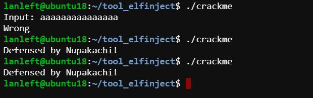

# Inject timer to ELF file

*Đang trong quá trình fix code để tự động hóa cả quá trình :vv*

### Miêu tả

Chèn thêm bộ đếm thời gian vào đầu file ELF, ví dụ trước 10h ngày xx/yy/zz thì vẫn chạy nhưng sau đó thì không chạy được :)))

Kỹ thuật này được đề cập trong quyển [Practical Binary Analysis](https://www.pdfdrive.com/practical-binary-analysis-build-your-own-linux-tools-for-binary-instrumentation-analysis-and-disassembly-e158534629.html)

### Sơ đồ
`create shellcode countdown` --> `encode shellcode timer` --> `mmap mem` --> `final shellcode` --> `inject ELF`

### Minh họa

### Reference

[LIEF](https://lief.quarkslab.com/doc/latest/tutorials/05_elf_infect_plt_got.html)

[ELF patchkit](https://blog.csdn.net/weixin_30764883/article/details/96114163)

[Special Sections](https://docs.oracle.com/cd/E19683-01/816-1386/chapter7-1/index.html)

[Lab in Practical Binary](https://github.com/lanleft/practical-binary)

